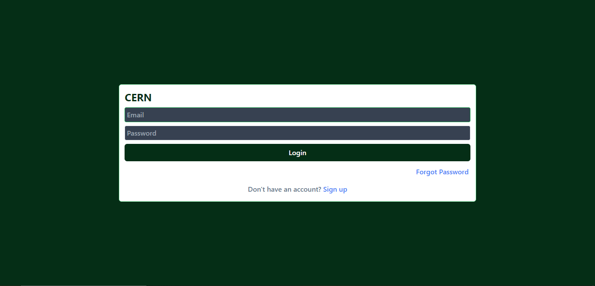
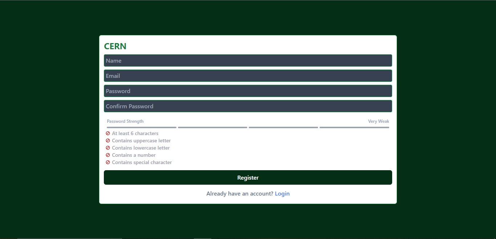
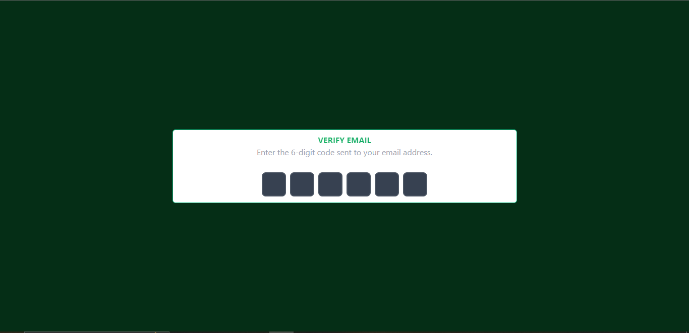
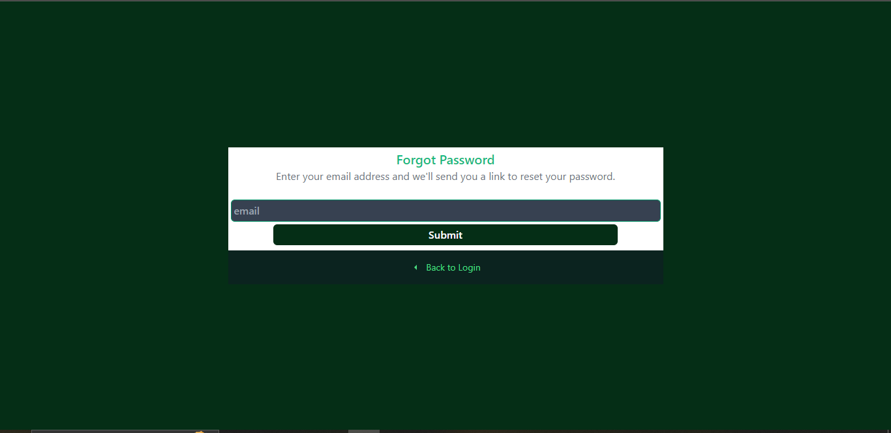
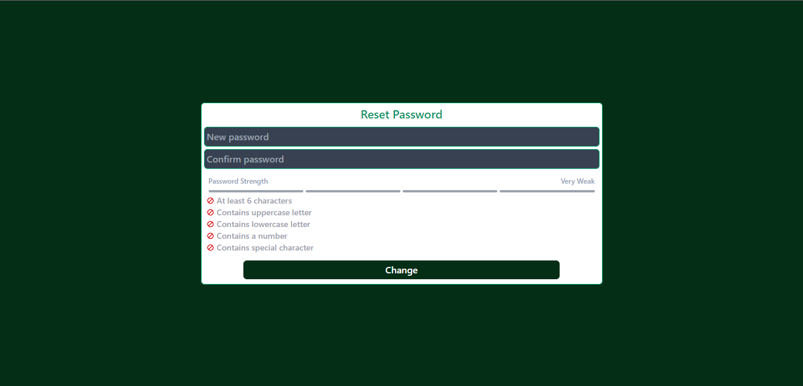
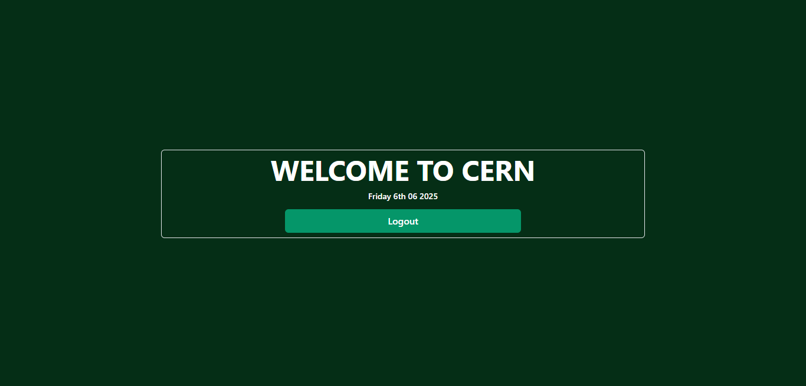

# CARN
CARN is a robust and modern fullstack authentication system built using the MERN stack . It provides essential auth features like user registration, login, Email verification, password reset, and secure route access, all wrapped in a responsive and clean UI powered by React.

## 🌐 Live Demo

🔗 [https://carn-i744.onrender.com](https://carn-i744.onrender.com)

---

## Snapshots

### Login UI


### Register UI


### Email Verification UI


### Forgot Password UI


### Password Reset UI


### Home Page UI


## 🚀 Features

- User registration & login
- Email verification via email (with Nodemailer)
- Password reset via email (with Nodemailer)
- JWT-based authentication
- Secure cookie handling
- Input validation
- Responsive UI with Ant Design
- Protected routes with token verification
- Full test coverage (unit, integration, E2E)
- Painless dev & build process with `concurrently`
- Cypress for E2E tests, Vitest & Jest for unit/integration

---

## Project Structure
```bash
ABIS/
├── Server/
│   ├── Controller/
|   ├── Model/
│   ├── Routes/
│   ├── Utilz/
│   ├── __tests__/
|   ├── setup.js
|   ├── jest.config.integration.js
|   ├── jest.config.unit.js
|   ├── app.js
│   ├── server.js
│   └── db.js
├── client/
│   ├── src/
│   ├── public/
│   ├── cypress/
|   ├── cypress.config.js
|   ├── tailwind.config.js
│   └── vite.config.js
├── .github/workflows/
│   └── deploy.yml (Cypress CI config)
└── README.md
```

## 🛠 Tech Stack

### 🧠 Frontend

- React 18
- React Router DOM
- Redux Toolkit + Redux Persist
- Ant Design
- Axios
- TailwindCSS
- React Toastify
- Helmet Async
- React Icons

#### Frontend Dev & Testing

- Vite
- Cypress (E2E)
- Vitest
- React Testing Library
- jsdom
- redux-mock-store

---

### 🖥 Backend

- Express.js
- Mongoose
- bcryptjs
- Cloudinary
- Multer
- Nodemailer
- JWT (jsonwebtoken)
- Helmet
- CORS
- Validator
- Morgan

#### Backend Dev & Testing

- Nodemon
- Jest
- Supertest
- node-mocks-http

---

## 🧪 Testing Overview

- **Server**: Jest & Supertest for controller and utility unit tests
- **client**: Vitest + React Testing Library for component testing
- **E2E**: Cypress for full end-to-end auth flows

---

## 📦 Getting Started

### Prerequisites

- Node.js (v18+ recommended)
- MongoDb Atlas (credentials in `.env`)
- Cloudinary account for image uploads

---

### 🖥 Local Development

1. **Clone the repo**

```bash
git clone https://github.com/CHIBUZOR-1/CARN.git
cd CARN
```

## Frontend
```bash
$ cd client # go to frontend folder
$ npm install # install packages
```
## Backend
```bash
$ cd Server # go to backend folder
$ npm install # install packages
$ npm run dev # starts both services App locally with concurrently
```
## Run Tests
### Frontend
```bash
$ cd client
$ npm vitest run # for integration tests
```
### Backend
```bash
$ cd Server
$ npm test # for integration tests
```
### Cypress E2E tests
```bash
cd client
npx cypress open
```

## Environment variables
```bash
MONGOOSE_URL=...
ORIGIN=...
MONGOOSE_URI_TEST=...
JWT_SECRET=...
HOSTPORT=...
EMAIL=...
PASSWORD=...
VITE_API_URL=...
SECURE=...
PORTZ=...
HOST=...
SERVICE=...
CLOUDINARY_CLOUD_NAME=...
CLOUDINARY_API_KEY=...
CLOUDINARY_API_SECRET=...
```

## 🧑‍💻 Author

**Chibuzor Henry Amaechi** — built CARN as a fullstack authentication showcase with CI/CD, testing, and modern tooling.